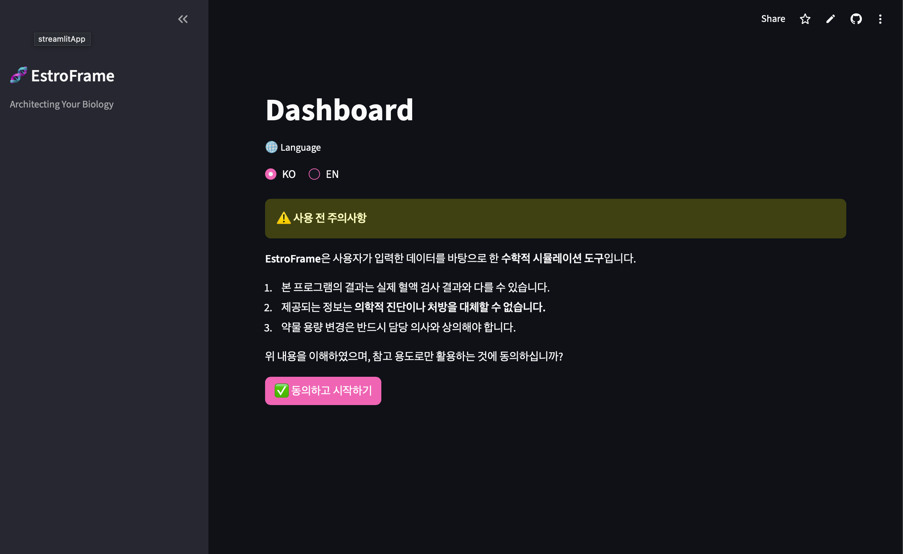
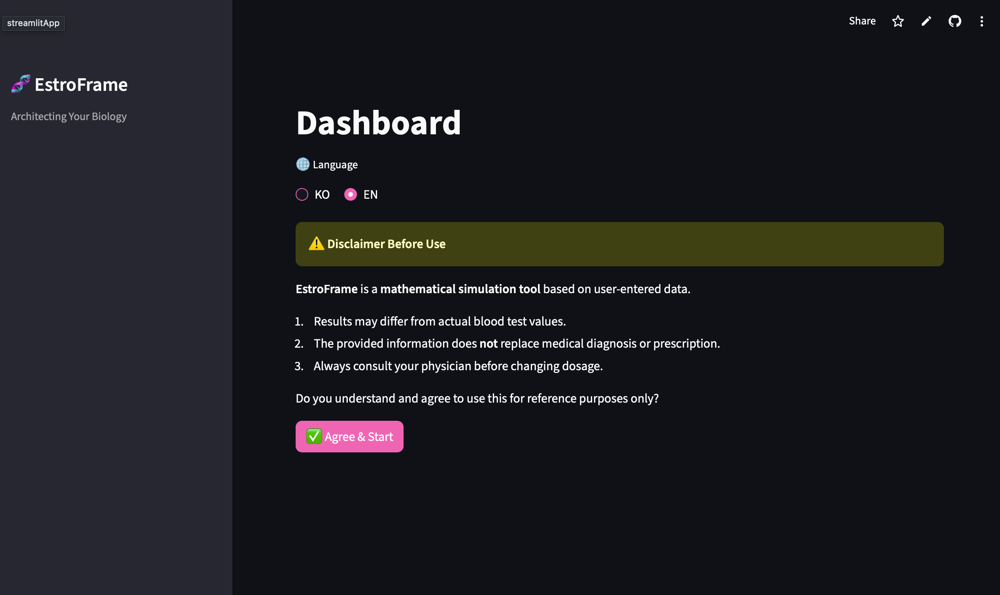
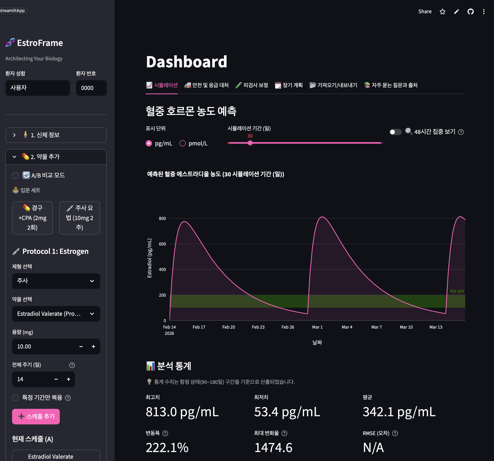
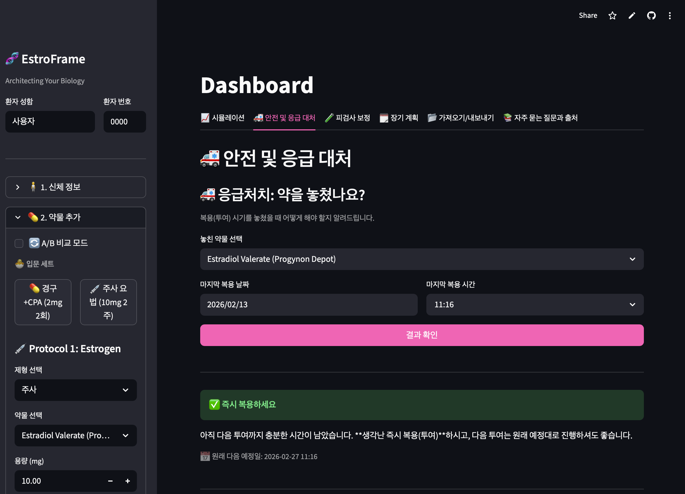
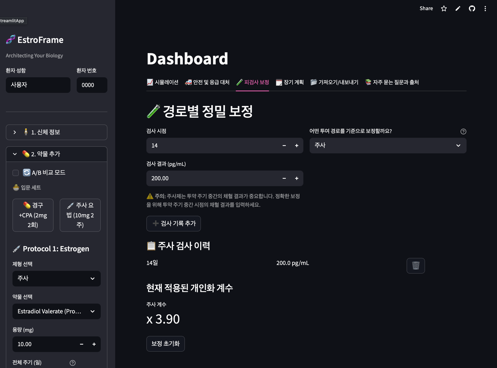
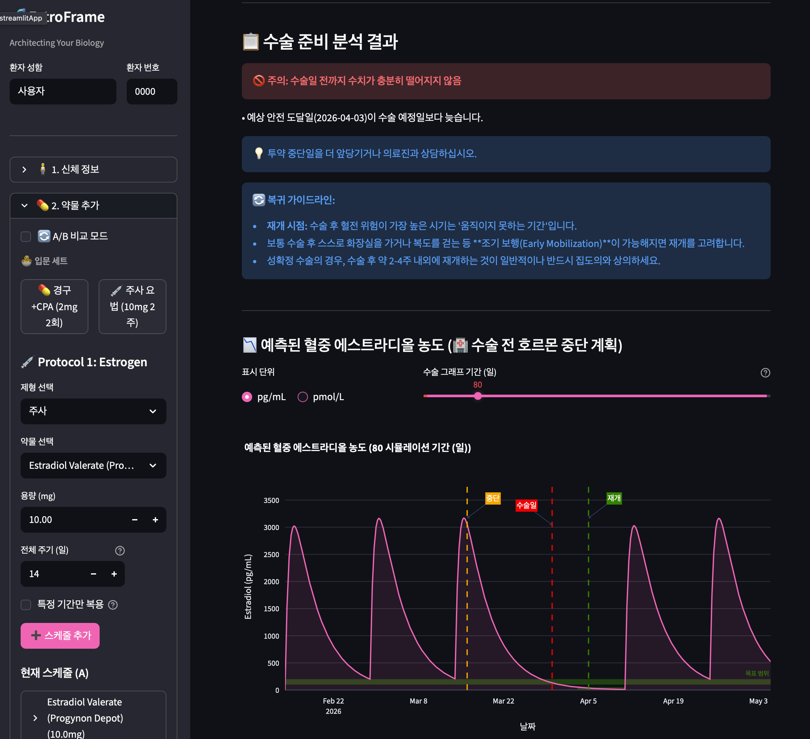
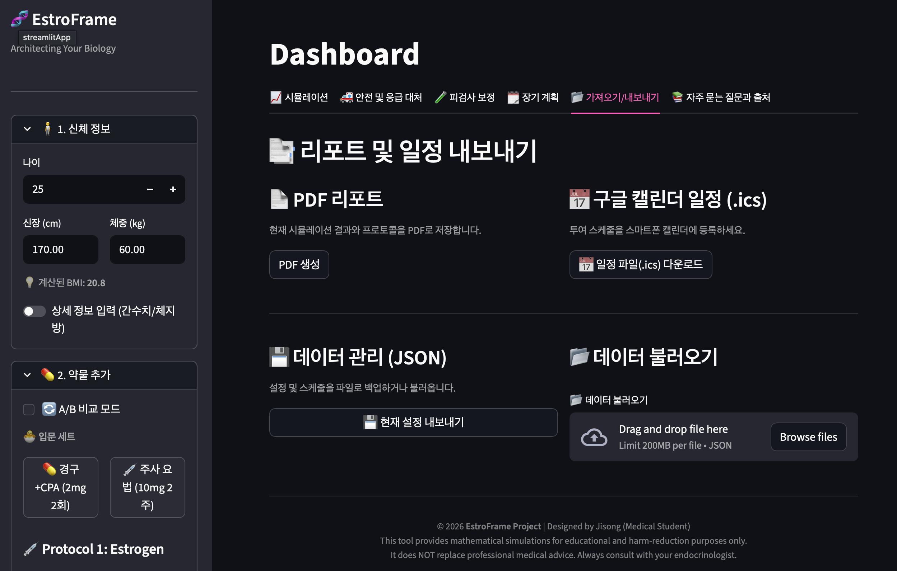
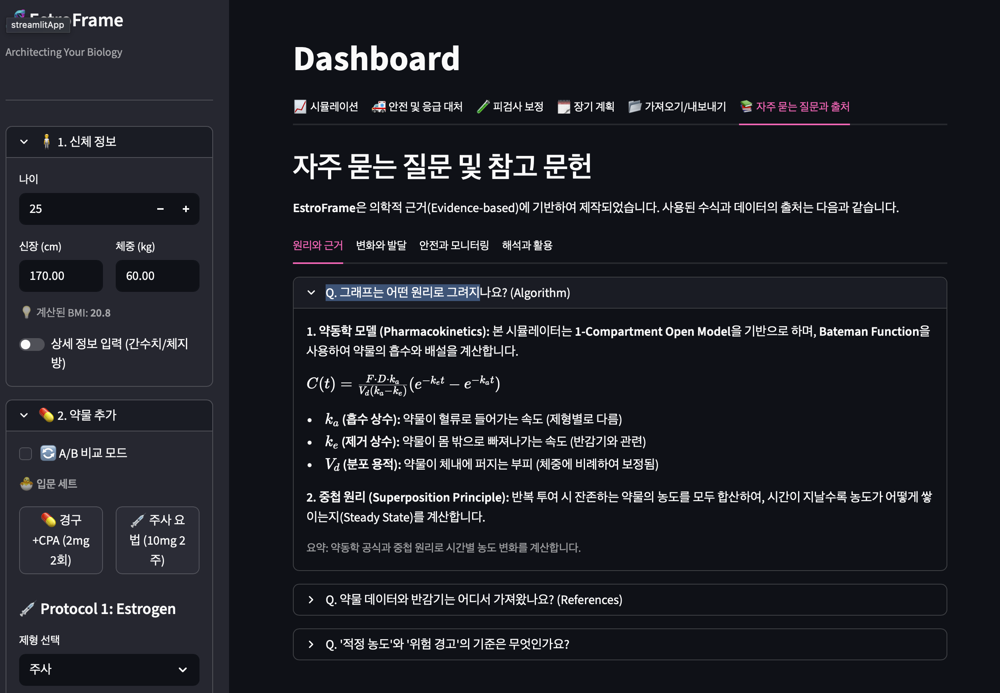

# 🧬 EstroFrame

**EstroFrame**은 트랜스페미닌 HRT(호르몬 치료) 스케줄을 시뮬레이션하고, 안전성/수술 계획/리포트/데이터 관리를 한 화면에서 수행하는 Streamlit 앱입니다.

- Version: `1.0.0(260214)`
- Stack: `Python`, `Streamlit`, `NumPy`, `Pandas`, `Plotly`, `ReportLab`
- Language: `KO / EN` (i18n 기반)

---

## 핵심 기능

### 1) 시뮬레이션
- 다중 투여 경로 지원: Injection, Oral, Transdermal, Sublingual
- 반복 투여 누적 농도 시뮬레이션
- 시나리오 A/B 비교 모드
- 단위 전환: pg/mL, pmol/L
- 실측 검사값과 RMSE 비교
- 핵심 지표 자동 계산: Peak, Trough, Avg, Fluctuation, Max slope

### 2) 수술 계획
- 수술 전 중단/수술일/재개일 일정 반영
- 수술 모드 그래프 시각화
- VTE 위험도 및 기본 안전 체크
- 수술 그래프 기간 조절(기본: 재개 후 30일 이상 확인)

### 3) 안전성 분석
- 환자 요인(흡연, VTE 과거력, 편두통 등) 반영
- 모노테라피/골건강 위험/급격 변동 등 경고
- 상호작용 약물 선택 기반 체크
- 모니터링 체크리스트 제공

### 4) 보정(Calibration)
- 경로별 혈액검사 기록 입력
- 경로별 보정계수(calibration factor) 적용
- 보정 이력/현재 계수 시각화

### 5) 데이터 입출력
- JSON 내보내기: 사용자 입력 상태 전체(session state 스냅샷)
- JSON 가져오기: 세션 복원
- ICS 내보내기:
  - 모든 투여 약물 일정
  - 수술 중단/수술일/재개 일정 포함

### 6) 리포트(PDF)
- 상담/기록용 PDF 자동 생성
- 포함 항목:
  - 프로필
  - 프로토콜(A/B)
  - 시뮬레이션 요약 지표
  - 보정/검사 이력
  - 안전성 결과
  - 그래프
  - 면책문구
- 최신 스타일 적용:
  - 브랜드 헤더(로고 자동 탐색)
  - 카드형 섹션
  - 섹션 아이콘 배지
  - 페이지 푸터/페이지 번호

### 7) 랜딩/다국어(i18n)
- 동의 랜딩 + 온보딩 랜딩
- 랜딩에서 바로 언어 전환 가능
- KO/EN 모드에서 혼용 문구 최소화

### 8) 오프라인/EMR
- 로컬/오프라인 환경 감지 및 강제 오프라인 모드 토글
- 오프라인 모드에서 EMR DB 관리 기능 활성화
- 환자 DB JSON/CSV 관리

### 9) FAQ
- 4개 범주로 구조화된 FAQ
- 항목별 한 줄 요약 제공

---

## 화면 구성

### 사이드바
- 신체 정보
- 약물 추가/편집
- 환자 리스크 평가
- 설정(언어 선택, 오프라인 모드 강제)
- 하단 크레딧: `Ver 1.0.0(260214)`

### 메인 탭
- 시뮬레이션
- 안전성
- 보정
- 수술
- 리포트
- FAQ
- (오프라인일 때) EMR

---

## 스크린샷

> 아래 이미지는 `docs/screenshots/` 경로를 기준으로 표시됩니다.

### 랜딩



### 사이드바


### 탭 화면







---

## 설치 및 실행

### 요구 사항
- Python 3.9+
- pip

### 1) 설치
```bash
pip install -r requirements.txt
```

### 2) 실행
```bash
streamlit run main.py
```

또는 macOS 실행 스크립트:
```bash
./run.command
```

---

## 오프라인(.app) 빌드 (macOS)

현재 오프라인 배포는 `stlite` 대신 macOS `.app` 번들 방식을 사용합니다.

### 1) 빌드 도구 설치
```bash
pip install pyinstaller pywebview
```

### 2) .app 빌드
```bash
pyinstaller --noconfirm --clean EstroFrame.spec
```

### 3) 실행
```bash
open dist/EstroFrame.app
```

참고:
- 첫 실행 시 macOS 보안 경고가 뜨면 앱을 우클릭 후 `열기`로 1회 허용하세요.
- 배포 시에는 `dist/EstroFrame.app` 번들 폴더 자체를 전달하면 됩니다.

---

## 프로젝트 구조

```text
EstroFrame/
├── main.py                 # 앱 엔트리
├── simulator.py            # 시뮬레이션 탭 로직
├── ui_components.py        # 사이드바/탭 UI 컴포넌트
├── analysis.py             # 약동학/분석 엔진
├── data.py                 # 약물/가이드 데이터
├── utils.py                # i18n, 계산 유틸
├── inout.py                # JSON/PDF/ICS/DB I/O
├── EMR.py                  # EMR 로딩/관리
├── i18n.json               # KO/EN 번역 리소스
├── launcher.py             # .app 실행용 런처
├── EstroFrame.spec         # PyInstaller 빌드 설정
└── requirements.txt
```

---

## 주의

이 앱은 교육/의사결정 보조용 시뮬레이터이며 의료기기가 아닙니다.
실제 처방 변경, 수술 전후 계획, 위험도 판단은 반드시 의료진과 상의해야 합니다.

---

## 라이선스

MIT License
